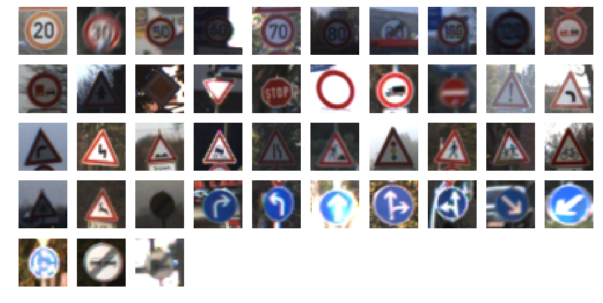
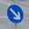
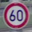
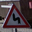

# **Traffic Sign Recognition** 

**Build a Traffic Sign Recognition Project**

The goals / steps of this project are the following:
* Load the data set (see below for links to the project data set)
* Explore, summarize and visualize the data set
* Design, train and test a model architecture
* Use the model to make predictions on new images
* Analyze the softmax probabilities of the new images
* Summarize the results with a written report

---

### Data Set Summary & Exploration

#### 1. Provide a basic summary of the data set. In the code, the analysis should be done using python, numpy and/or pandas methods rather than hardcoding results manually.

I calculated the following summary statistics on the dataset:

* The size of training set is 34799 images.
* The size of the validation set is 4410 images.
* The size of test set is 12630 images.
* The shape of a traffic sign image is 32x32 pixels with 3 color channels.
* The number of unique classes/labels in the data set is 43.

#### 2. Include an exploratory visualization of the dataset.

Here is an exploratory visualization of the data set. It shows one representative sign from each class of signs:

### Design and Test a Model Architecture

#### 1. Describe how you preprocessed the image data. What techniques were chosen and why did you choose these techniques? Consider including images showing the output of each preprocessing technique. Pre-processing refers to techniques such as converting to grayscale, normalization, etc. (OPTIONAL: As described in the "Stand Out Suggestions" part of the rubric, if you generated additional data for training, describe why you decided to generate additional data, how you generated the data, and provide example images of the additional data. Then describe the characteristics of the augmented training set like number of images in the set, number of images for each class, etc.)

To preprocess the image data, I normalized the pixel values so that each RGB channel was in the range [-1, 1), with 0 mapped to -1 and 255 mapped to approximately 1.

#### 2. Describe what your final model architecture looks like including model type, layers, layer sizes, connectivity, etc.) Consider including a diagram and/or table describing the final model.

My model architecture is a [LeNet-5](http://yann.lecun.com/exdb/publis/pdf/lecun-01a.pdf) model. The only modifications I made were to allow for 3 input channels and 43 output logits instead of the 1 and 10, respectively, used for the MNIST dataset.

The LeNet-5 architecture consists of the following layers:

| Layer                 |     Description                               | 
|:---------------------:|:---------------------------------------------:| 
| Input                 | 32x32x3 RGB image                             | 
| Convolution 5x5       | 1x1 stride, valid padding, outputs 28x28x6    |
| RELU                  |                                               |
| Max pooling           | 2x2 stride,  outputs 14x14x6                  |
| Convolution 5x5       | 1x1 stride, valid padding, outputs 10x10x16   |
| RELU                  |                                               |
| Max pooling           | 2x2 stride,  outputs 5x5x16                   |
| Fully connected       | Input 400, output 120                         |
| RELU                  |                                               |
| Fully connected       | Input 120, output 84                          |
| RELU                  |                                               |
| Fully connected       | Input 84, output 43                           |
| RELU                  |                                               |
| Softmax               |                                               |

#### 3. Describe how you trained your model. The discussion can include the type of optimizer, the batch size, number of epochs and any hyperparameters such as learning rate.

To train the model, I used the ADAM optimizer with a learning rate of 0.001. I trained for 50 epochs using a batch size of 128 (although little improvement on the validation accuracy was seen after the 16th epoch).

#### 4. Describe the approach taken for finding a solution and getting the validation set accuracy to be at least 0.93. Include in the discussion the results on the training, validation and test sets and where in the code these were calculated. Your approach may have been an iterative process, in which case, outline the steps you took to get to the final solution and why you chose those steps. Perhaps your solution involved an already well known implementation or architecture. In this case, discuss why you think the architecture is suitable for the current problem.

The vanilla LeNet had an accuracy of just under 93%, not quite meeting the threshold for submission. I tried two things to increase the accuracy.

The first was converting the input images to the HSV color space. HSV is useful in many classical computer vision approaches, and matches human perception more closely than RGB. Since the signs are intended to be recognized by humans, I thought the HSV transform would reduce the amount of work the model would have to do, allowing it to learn higher-level features. However, I found that the model trained more slowly with the HSV inputs and never reached even the 93% performance that RGB achieved, so I abandoned this direction.

The second was using dropout to train the network (only in the fully-connected layers, not the convolutional layers). Using dropout with a keep-probability of 50% yielded 96% accuracy on the validation set.

My final model results were:
* training set accuracy of 99.8%
* validation set accuracy of 96.8%
* test set accuracy of 94.5%
 

### Test a Model on New Images

#### 1. Choose five German traffic signs found on the web and provide them in the report. For each image, discuss what quality or qualities might be difficult to classify.

Here are five German traffic signs that I found on the web:

#### 2. Discuss the model's predictions on these new traffic signs and compare the results to predicting on the test set. At a minimum, discuss what the predictions were, the accuracy on these new predictions, and compare the accuracy to the accuracy on the test set (OPTIONAL: Discuss the results in more detail as described in the "Stand Out Suggestions" part of the rubric).

The model classified all of the images correctly:

| Image                 |     Prediction             | 
|:---------------------:|:--------------------------:| 
| No entry              | No entry                   | 
| Go straight or right  | Go straight or right       | 
| Keep right            | Keep right                 |
| Speed limit (60km/h)  | Speed limit (60km/h)       |
| Double curve          | Double curve               |

#### 3. Describe how certain the model is when predicting on each of the five new images by looking at the softmax probabilities for each prediction. Provide the top 5 softmax probabilities for each image along with the sign type of each probability. (OPTIONAL: as described in the "Stand Out Suggestions" part of the rubric, visualizations can also be provided such as bar charts)

For the first 3 images, the model was extremely confident in its classification. The model assigned a liklihood of less than 1 in 1 billion to the second most likely class for each of these images.

For the last two images, it was less sure. On the 4th image (a 60 km/h sign), it assigned a probability of about 1.3 in 1 million to the "Speed limit (80km/h)" class, and negligable probability to the other classes. On the 5th image, it assigned a probability of 226 in 1 million to "Dangerous curve to the left", 170 in 1 million to "Road narrows on the right", 2.5 in 1 million to "Beware of ice/snow", and 1.3 in 1 million to "Right-of-way at the next intersection". All of these are equilateral triangle signs with red borders (upside-down yield signs), which explains why the model found them similar.
